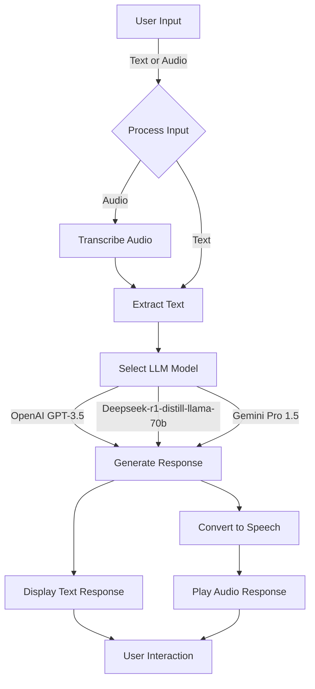

<div align="center">
<h1> Multi-Model Chatbot with Text & Audio Input</h1>
</div>
<div align= "justify">
This is a Streamlit-based chatbot that supports multiple LLMs and allows users to interact using text or audio. The chatbot can transcribe speech, generate responses using OpenAI, Groq, and Gemini models, and convert text responses back to speech.


### Live Demo
[Try the Chatbot Here](https://harsh4032multimodelbot.streamlit.app)

---

## System Architecture: Comparative Overview

### Approach 1: Basic Voice Bot
The [Voice-Bot](https://github.com/harshit4032/Voice-Bot) represents the initial approach, featuring:

Single LLM Integration: Utilizes a single language model for response generation.
Limited Input Modalities: Primarily supports audio input without fallback to text.
Basic Error Handling: Minimal mechanisms for handling transcription or model failures.

### Approach 2: Enhanced Multi-Model Chatbot (This Project)
This project builds upon Approach 1 by introducing:

Multi-Model Support: Integrates OpenAI GPT-3.5, Deepseek-r1-distill-llama-70b, and Gemini Pro 1.5.
Dual Input Modes: Accepts both text and audio inputs, enhancing accessibility.
Robust Error Handling: Implements fallback mechanisms and redundancy for improved reliability.
Enhanced User Interface: Offers a more interactive and user-friendly Streamlit UI.
Reliability Block Diagram

This diagram illustrates the enhanced reliability and functionality of Approach 2 compared to Approach 1.


## Flowchart


---

## Features
- Supports Multiple LLMs: OpenAI GPT-3.5, Deepseek-r1-distill-llama-70b, and Gemini Pro 1.5.
- Dual Input Mode: Users can either type text or upload an audio file.
- Speech-to-Text (STT): Converts voice input to text using Whisper.
- LLM Integration: Processes queries using the selected language model.
- Text-to-Speech (TTS): Converts the LLM's response into speech.
- Streamlit UI: Clean and interactive interface for an enhanced user experience.

---

## Installation

### 1. Clone the Repository
```bash
git clone https://github.com/harshit4032/chatbot.git
cd chatbot
```

### 2. Install Dependencies
```bash
pip install -r requirements.txt
```

### 3. Set Up API Keys

Create a `.streamlit/secrets.toml` file and add your API keys:

```toml
[secrets]
OPENAI_API_KEY = "your_openai_key"
GROQ_API_KEY = "your_groq_key"
GOOGLE_API_KEY = "your_google_key"
TAVILY_API_KEY = "your_tavily_key"
```

Important: Do not hardcode API keys in the code. Always use secrets management.

### 4. Run the App
```bash
streamlit run app.py
```

---

## Deploy on Streamlit Cloud

1. Push your code to GitHub.
2. Go to [Streamlit Cloud](https://share.streamlit.io/).
3. Deploy the repo and add your API keys in the Streamlit Cloud secrets manager.
4. Click Deploy and start chatting.

---

## Usage
1. Select a Model from the sidebar.
2. Upload an audio file or type a question.
3. The chatbot will transcribe (if audio) and generate a response.
4. The response is displayed as text and can be played as audio.

---

## Tech Stack
- Frontend: Streamlit
- Speech-to-Text: OpenAI Whisper
- LLMs: OpenAI GPT-3.5, Groq, Gemini Pro
- Text-to-Speech: OpenAI TTS-1

---

## Contributing
Feel free to fork the repo, open issues, or submit pull requests.
</div>

